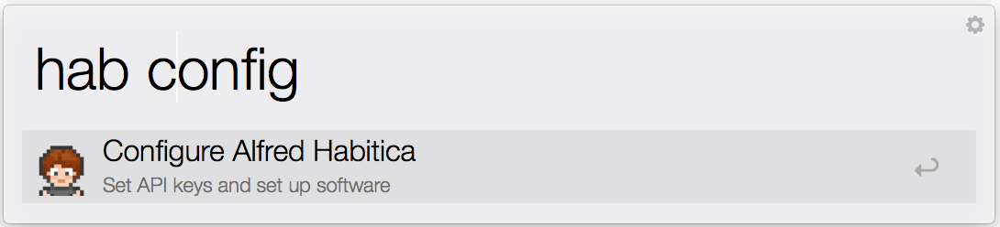
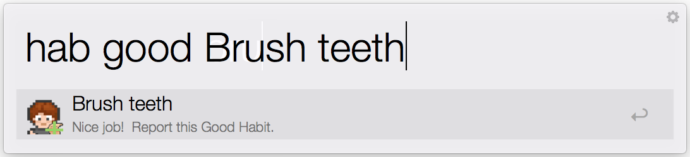
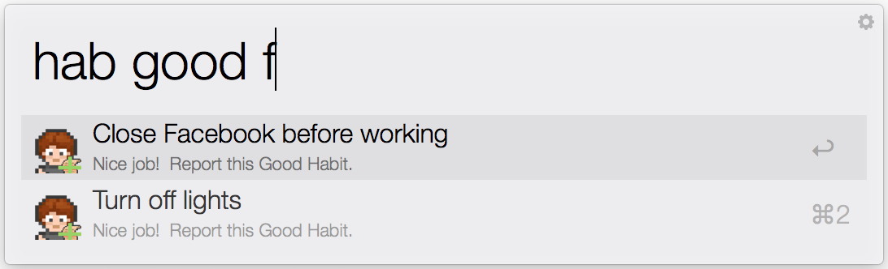
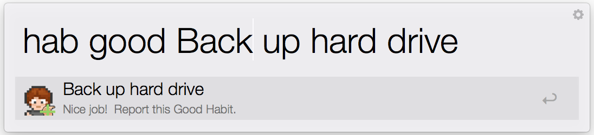
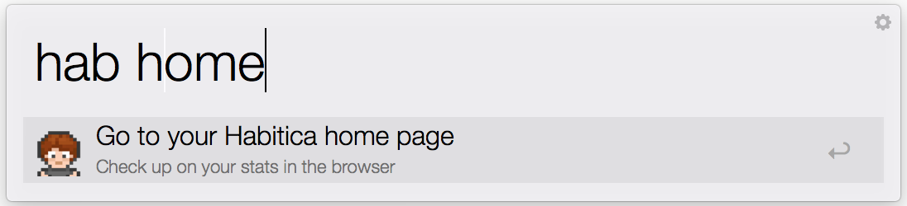
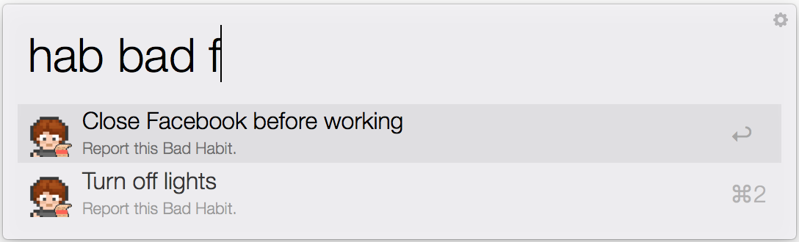
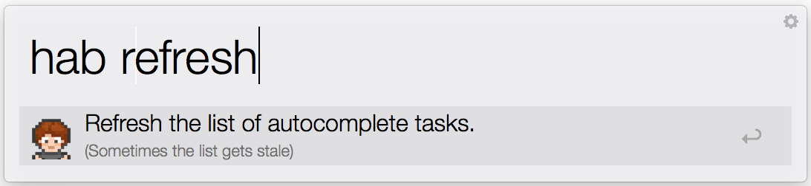

# Alfred Habitica

This package provides some lightweight Alfred integration for [Habitica](http://habitica.com/) users.
Habitica is a video game built to help you keep up with your habits by turning habit-keeping into a quest.

# How to Use this Workflow

## Getting set up

Download the current version from this [public link](https://dl.dropboxusercontent.com/u/4148918/Alfred-Habitica-1.1.0.alfredworkflow).

To start using the package, first call `hab config`.

You will see a lightweight wizard that asks for your Habitica API key and user ID.
These are only stored in a local configuration file in the workflow directory and only used to make requests to the Alfred API on your behalf.
The configuration wizard will download a couple of dependencies for reaching the API and notify you when it is finished.
Then you will be ready to start reporting tasks!

## Reporting tasks

_This workflow supports reporting Good and Bad Habits._
The `hab good` key command lets you report Good Habits, like this one for "Brush teeth":

*Autocomplete* will fill in all habits that you have defined online with Habitica.
For example:

You can also *create new habits* by describing a new name of a habit.
Here, I make one for backing up my computer.

You can verify that your habits have been created and that you have gained experience or
taken damage by visiting your online profile.
To see your online profile, just call `hab home`:

To report Bad Habits, use the `hab bad` key command:

It is symmetric to `hab good` in that it also supports auto complete and creating new habits.

## Keeping habit list up to date

The autocomplete habits will get stale after you change habits in the online interface or create new ones through key commands.
The `hab refresh` key command will refresh the local list of tasks:

*Note* that this will also remove from autocomplete any old tasks that used to exist but have been deleted online.

## Everything else

These are all the available key commands.
If you want to review the available commands from Alfred, just type `hab`, and they will be listed.

# Questions?

Feel free to open an issue.
Please let me know if you encounter any bugs.

Want to contribute?
I'd love to have someone help flesh this workflow out.

# License

MIT.
This should be safe to use, but as always, use at your own risk.

## Disclaimer

This project is in no way officially affiliated with Habitica.
This is a project that I just put together in my free time.

# Credits

The icons for this package comes from the Habitca project,
which are made available through the CC-BY-NC-SA 3.0 license (see [Habitica license](https://github.com/HabitRPG/habitrpg/blob/develop/LICENSE)).
The original icons can be found at:
* https://github.com/HabitRPG/habitrpg/blob/develop/website/public/front/images/avatar/avatarstatic.png
* https://github.com/HabitRPG/habitrpg/blob/develop/common/img/sprites/spritesmith/misc/inventory_quest_scroll.png

Thanks to Habitica for making their [API](https://habitica.com/static/api) available for apps like this.
